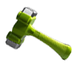

# whack a mole game
it is fun game based on click reflexes user must hit the mole which be appeared in short time in some divs

first version was just functionality then with v:1.0.1 i added some style
#### the main function was startPlay , to focus first

```javaScript
function startPlay() {
  if (!progress) {
    score.textContent = 0;
    let countD = setInterval(() => {
    Time.textContent = Number(Time.textContent) - 1;
    }, 1000); //decereasing Time every one sec

    progress = true; //used for perventing double execution
    let interval = setInterval(addPic, 1000);
    setTimeout(() => {
      clearInterval(interval);
      clearInterval(countD);
      progress = false;
      disabled = true;
      Time.textContent = 60;
    }, 60000);
  }
}
```
---
---
## version 2
in version two game got some good style such as animation and added hammer as curser and for that i just used css.
in style of the container of all sections (.game)
```css
.game{
  cursor: url("./images/hammer-be.png"), auto;
}
.game:active {
  cursor: url("./images/hammer-af.png"), auto;
}
```
i used two picture as you can see one for defult and one for click

 



### styles added for click

 for after click on section beyond the simple function which add or decerease the points , for style i added sound effect and red alert for clicking on empty section

 ---
